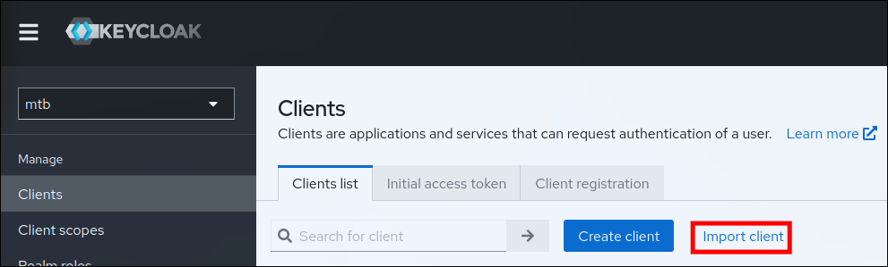
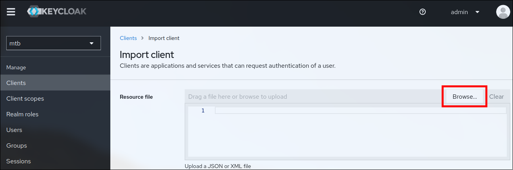
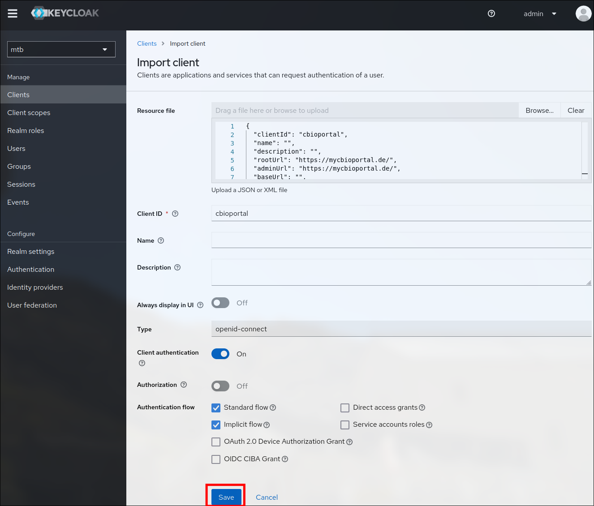
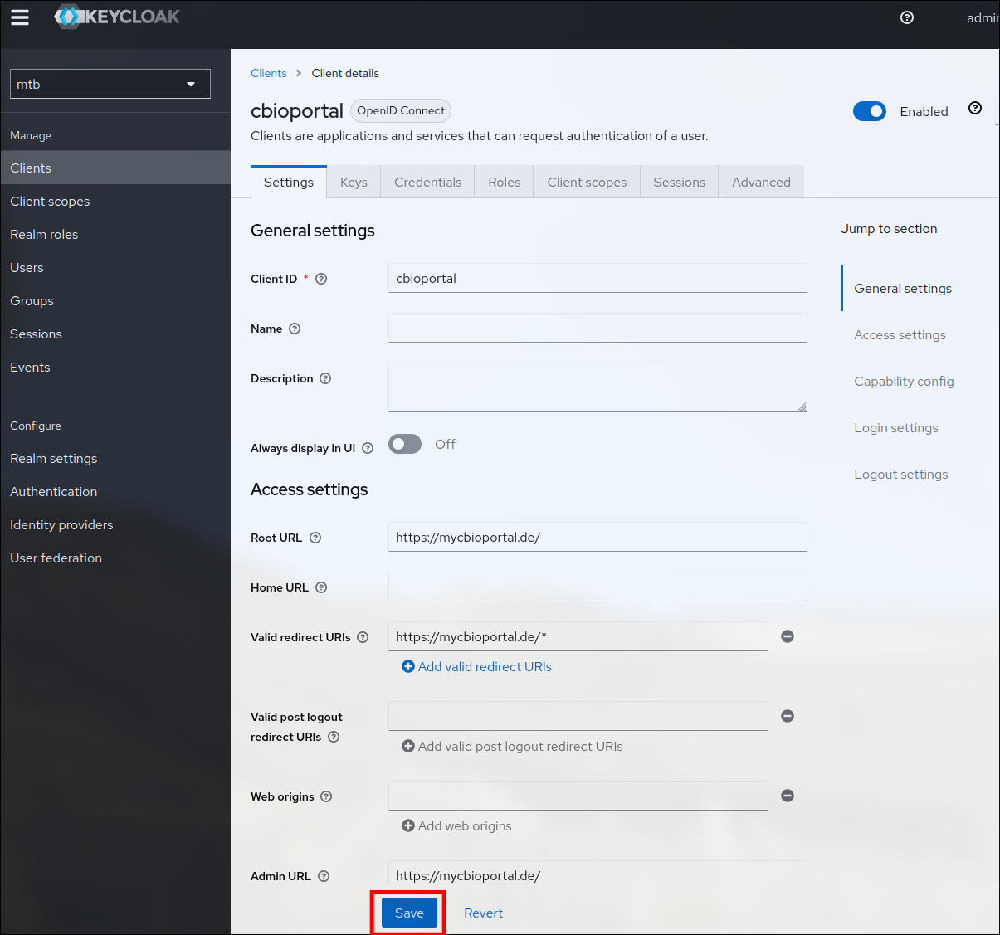
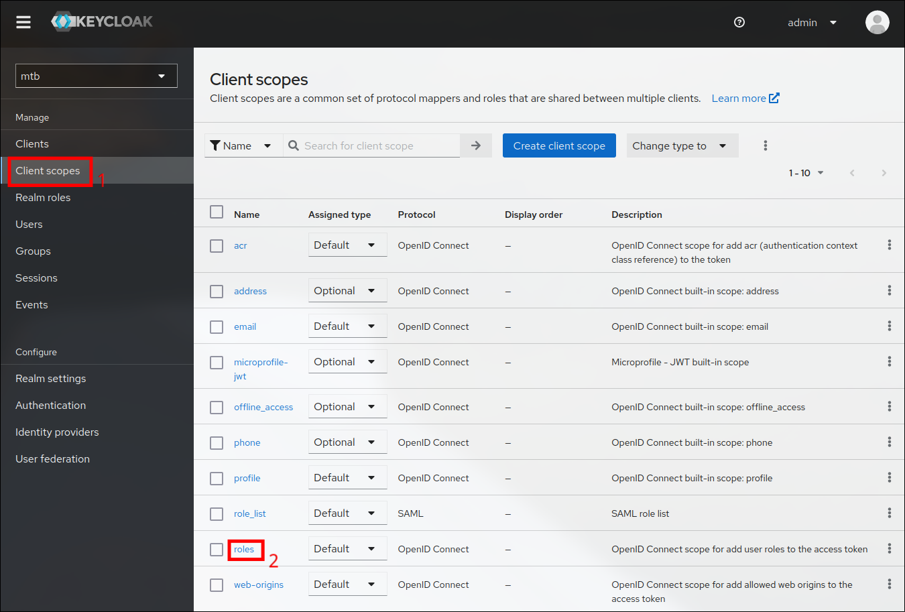
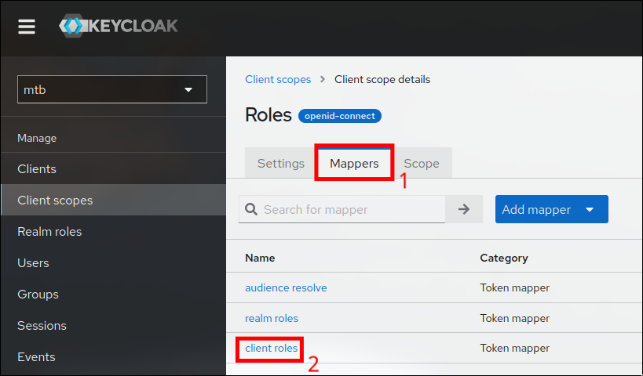
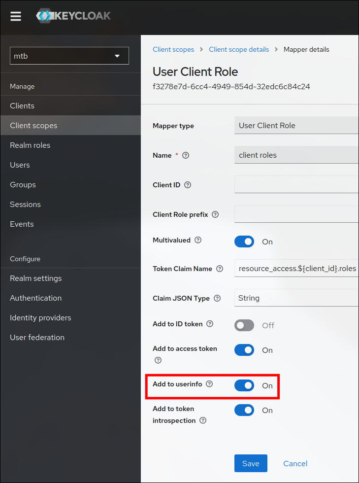

# Installation

## Prerequisites

1. A system with at least
    - 4 CPU cores
    - 10 GB of RAM
    - 100GB of free disk space
2. A container environment like Docker or Podman with support for Compose V3 (e.g. through `docker-compose`, `podman-compose`, etc.)

The following steps will assume the usage of Docker  without an explicitly stated `sudo` command.

Using HTTPS also requires:

1. A reverse proxy that will terminate the HTTPS of the cBioPortal instance (preferrably nginx)
2. A DNS name for cBioPortal with a **full chain** webserver certificate

Using Keycloak is only supported when using HTTPS but also requires:

1. A Keycloak instance with HTTPS
2. An export of the Keycloaks **full chain** webserver certificate 

It is recommended to start with a setup without authentication and add that later on.

## Setup without authentication

### 1. Clone the git repository

```
git clone https://github.com/buschlab/MTB-cbioportal.git
cd MTB-cbioportal
```

### 2. Derive environment from the default

```
cp .env.example .env
```

Start editing the `.env` file with a text editor. By default the installation will point to a release with a fixed tag. Using the `latest` tag may provide more features but can also result in unexpected errors.

Using OncoKB will all annotations requires a token that can be obtained [here](https://www.oncokb.org/apiAccess). This must be entered into the `.env` file as well as the `#` before the parameter `ONCOKB_URL` removed.

By default MTB-cbioportal is exposed on port 8080, if that one is not available, please change it in the `.env` file.

If the network requires a proxy, please use the parameter `HTTPS_PROXY_PORT`.

Please set the password for the databases **now** in the `.env` file. They will be written to config files and the databases will initialize with the provided value. Changing this afterwards must be done manually!

### 3. Initialize config files

```
docker-compose -f init.yml run --rm cbioportal
```

This will download the SQL files to initalize the cBioPortal database and also initialize the config file for the database.

### 4. Starting MTB-cbioportal

Now start MTB-cBioPortal. 

```
docker-compose up -d
```

If the system is limited in I/O capabilities, a timeout might occur. This timeout can be increased by using

```
COMPOSE_HTTP_TIMEOUT=200 docker-compose up -d
```

After the command is complete it should be possible to access cBioPortal on your machine using the webbrowser on the previously specified port.
When using a remote machine and a rootless container environment like Podman, it might be neccessary to add the port to the firewall.

### 5. Importing data

To import one of the provided test data sets use the following command

```
docker-compose exec cbioportal metaImport.py -u http://cbioportal:8080 -s study/testpatient -o
```

The adress here doesn't require any change, as it's being called from inside the container.

## Add HTTPS

Adding HTTPS to MTB-cBioPortal requires a reverse proxy that terminates HTTPS. 

It must set the following headers, so that URLs are being constructed correctly:

```
X-Forwarded-Proto
X-Forwarded-Port
```

Using nginx is recommended but Apache or Traefik will also work. A very simple nginx config for this can look like this: 

```
server
{

	listen 443 ssl http2;
	server_name mycbioportal.de;
	ssl_certificate /certs/tls.pem;
	ssl_certificate_key /certs/tls.key;

	client_max_body_size 0;

	location /
	{

		proxy_headers_hash_max_size 512;
		proxy_headers_hash_bucket_size 64;
		proxy_buffer_size 128k;
		proxy_buffers 4 256k;
		proxy_busy_buffers_size 256k;
		proxy_set_header Host $http_host;
		proxy_set_header X-Forwarded-Proto $scheme;
		proxy_set_header X-Forwarded-Port $server_port;
		proxy_set_header X-Real-IP $remote_addr;
		proxy_set_header X-Forwarded-For $proxy_add_x_forwarded_for;

		proxy_pass http://mycbioportal:8080;

	}

}

server
{

	listen 80;
	server_name mycbioportal.de;

	return 301 https://mycbioportal.de$request_uri;

}
```

Adding the reverse proxy doesn't require a restart of cBioPortal and should 

## Add authentication

The final cherry on top is the authentication. For this a working cBioPortal instance with HTTPs is mandatory.

### 1. Set up Keycloak

It is recommended to set up a dedicated realm in keycloak for cBioPortal, even though it is not neccessary. However, it is strongly advides not to use the master realm!

#### Importing clients

The following instructions assume that Keycloak runs at `https://mykeycloak.de` and cBioPortal runs at `https://mycbioportal.de`

Login to Keycloak, select the desired realm and click on *Clients*. Then hit the *Import client* button.



Now hit the *Browse...* button and select the `cbioportal_client_export.json` from the `conf` directory of MTB-cbioportal.




If desired the client *Cliend ID* can be changed now, the rest will be modified later.
Click the save button.



The first step is configuring the cbioportal client. Click on the *Clients* section and open the cbioportal client.

Adjust the *Root URL*, *Valid redirect URIs* and *Admin URL*. Replace `https://mycbioportal.de` with the URL of your HTTPS-enabled cBioPortal. Make sure to keep the `/*` and the end of the redirect URI. If this is not set correctly Keycloak will refuse to offer a login prompt.

Click the *Save* button to save the new URLs. 



Repeat the same process with the `cbioportal_client_export.json` file.  The credentials will later be used as `KEYCLOAK_SECRET_FHIRSPARK` in step 3.

#### Exporting client roles

Navigate to to the *Client scopes* section of the realm and click *roles*.



Switch to the *Mappers* tab and hit *client roles*.



Make sure that *Add to userinfo* is enabled.



### 2. Setup MTB-cbioportal

Replace the `keycloak.pem` file in the `config` directory with the webserver certificate from keycloak. 

```
LOGINREQUIRED=true
AUTHENTICATE=oauth2
EXCLUDE_AUTOCONFIG=
KEYCLOAK_URL=https://mykeycloak.de
CBIOPORTAL_URL=https://mycbioportal.de
KEYCLOAK_REALM=mtb
KEYCLOAK_CLIENT_CBIOPORTAL=cbioportal
KEYCLOAK_SECRET_CBIOPORTAL=mysecret
KEYCLOAK_CLIENT_FHIRSPARK=fhirspark
KEYCLOAK_SECRET_FHIRSPARK=mysecret
```

If data access via tokens to query the API (see docs [here](https://docs.cbioportal.org/web-api-and-clients/)) shall be enabled, set

```
DATA_ACCESS_TOKEN=oauth2
```

Shut down all services using
```
docker-compose down
```

Run the initialization command again, as it will add the Keycloak certificate to the trusted castore for cBioPortal.

```
docker-compose -f init.yml run --rm cbioportal
```

After that start cBioPortal again using
```
docker-compose up -d
```

### 3. Dumping portal info

The import process contains checks against available datasources in cBioPortal. As the enabled authentication blocks direct API access the required data must be exported to disk. For this use the following command

```
docker-compose exec cbioportal bash /cbioportal/dumpPortalInfo.sh
```

Importing data must now use the provided portalinfo. The updated import command looks like this
```
docker-compose exec cbioportal metaImport.py -p /cbioportal/portalinfo -s study/patient_example -o
```

## Troubleshooting

Will be constantly updated...