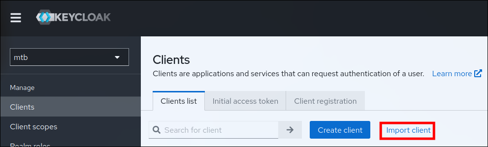
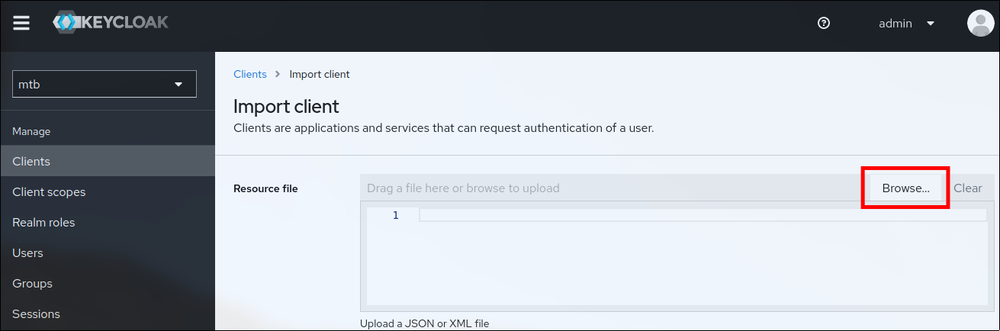
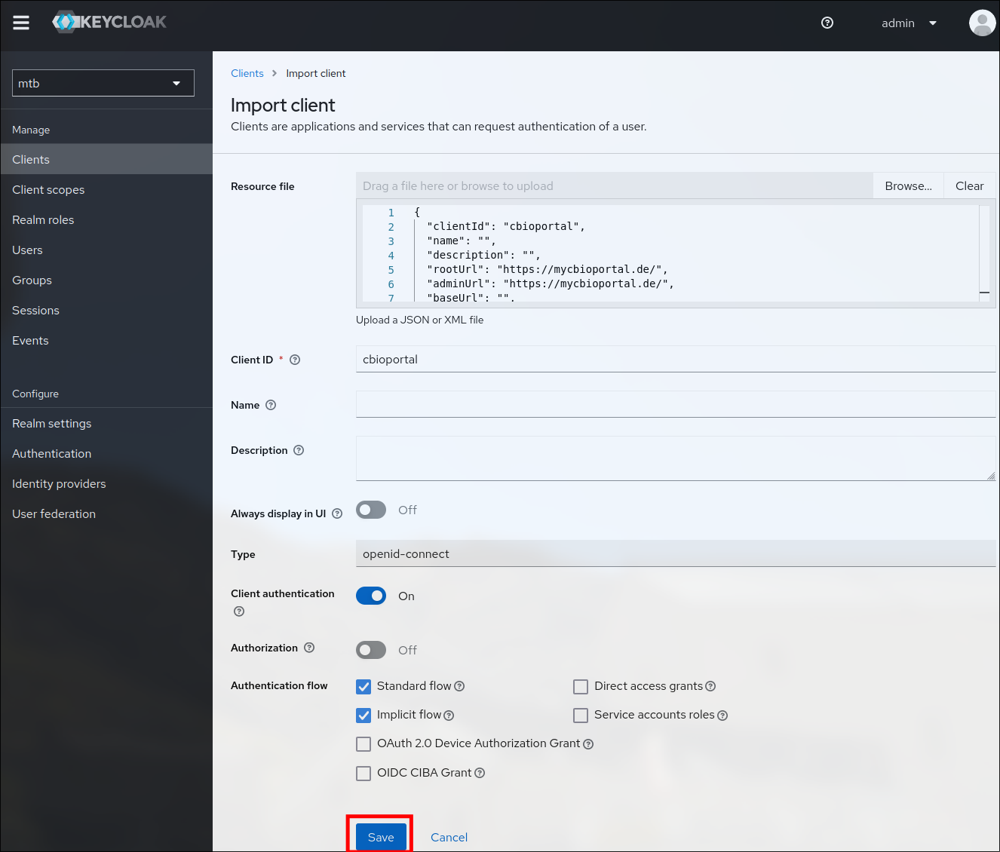
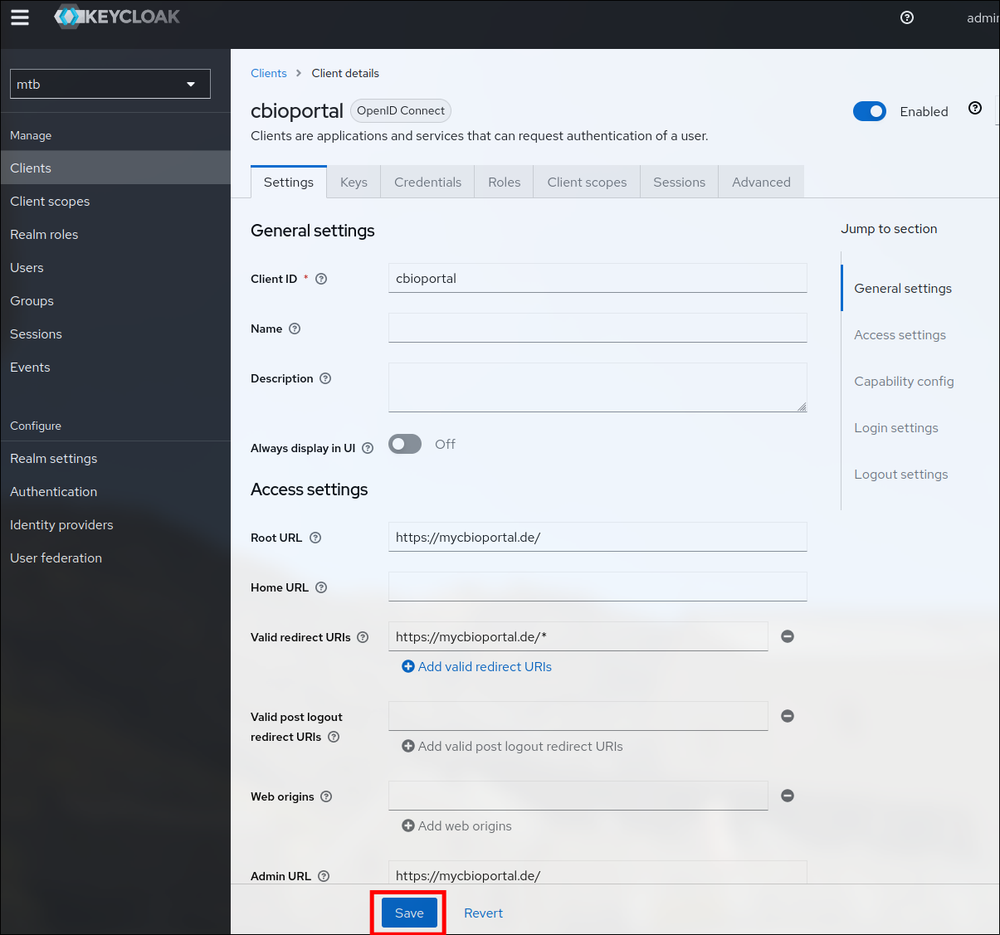
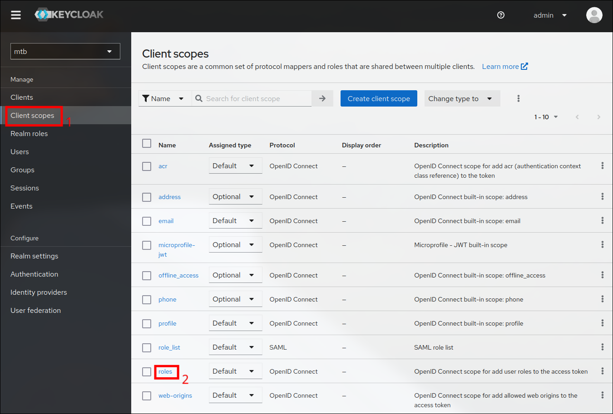
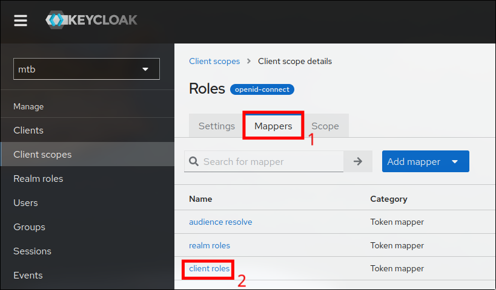
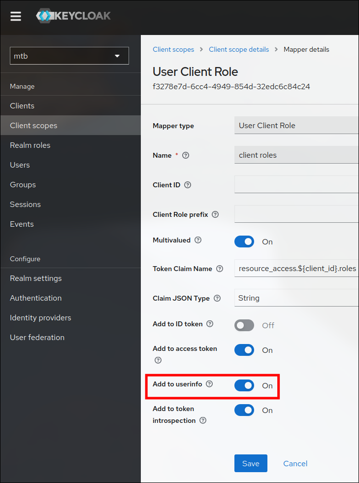

# Installation Guide

This guide walks you through deploying MTB-cBioPortal. It is recommended to follow the sections in order:

1. [Basic setup (no authentication)](#1-basic-setup-no-authentication) — get the system running first
2. [Add HTTPS](#2-add-https) — required before enabling authentication
3. [Add authentication (Keycloak)](#3-add-authentication-keycloak) — optional, requires HTTPS

---

## Prerequisites

Before you start, make sure you have:

- **Server requirements:** at least 4 CPU cores, 10 GB RAM, 100 GB free disk space
- **Docker** with Compose V3 support (`docker compose`, `podman-compose`, etc.)

For HTTPS (required for authentication):
- A reverse proxy (nginx recommended) to terminate SSL
- A DNS name with a full-chain TLS certificate

For Keycloak authentication:
- A running Keycloak instance with HTTPS
- The Keycloak server's full-chain certificate (`.pem`)

---

## 1. Basic Setup (No Authentication)

### Clone the repository

```bash
git clone https://github.com/pm4onco/MTB-cbioportal.git
cd MTB-cbioportal
```

### Configure the environment

```bash
cp .env.example .env
```

Open `.env` in a text editor and review the following settings:

| Setting | What to do |
|---|---|
| Image tag | Default is a fixed release tag recommended for stability. Switch to `latest` only if you need newer features and accept the risk of instability. |
| Port | By default, the app runs on port `8080`. Change it here if needed. |
| Database passwords | **Set these now.** They are written to config files during initialization. Changing them later requires manual database edits. |
| OncoKB token | Optional. Obtain a token at [oncokb.org/apiAccess](https://www.oncokb.org/apiAccess), paste it into the file, and remove the `#` before `ONCOKB_URL`. |
| Proxy | If your network requires a proxy, set `HTTPS_PROXY_PORT`. |

### Initialize configuration files

Without a proxy:
```bash
docker compose -f init.yml run --rm cbioportal
```

With a proxy:
```bash
docker compose -f init.yml run --rm -e https_proxy=http://proxyurl:port cbioportal
```

This downloads the cBioPortal seed database and generates the database config files.

> If you are not running as root, fix directory permissions after this step:
> ```bash
> sudo chmod 755 data/
> ```

### Start MTB-cBioPortal

```bash
docker compose up -d
```

If startup times out on a slow system:
```bash
COMPOSE_HTTP_TIMEOUT=200 docker compose up -d
```

Once running, open your browser and go to `http://localhost:8080` (or your configured port).

> **Rootless Podman users:** You may need to open the port in your firewall manually.

### Import test data

To verify the setup with a sample dataset:

```bash
docker compose exec cbioportal metaImport.py -u http://cbioportal:8080 -s study/testpatient -o
```

The URL here is internal to the container, no changes needed.

---

## 2. Add HTTPS

HTTPS is handled by a **reverse proxy** in front of cBioPortal. MTB-cBioPortal does not terminate TLS itself.

The reverse proxy must forward these headers so that URLs are generated correctly:

```
X-Forwarded-Proto
X-Forwarded-Port
```

### Example nginx configuration

```nginx
server {
    listen 443 ssl http2;
    server_name mycbioportal.de;
    ssl_certificate /certs/tls.pem;
    ssl_certificate_key /certs/tls.key;

    client_max_body_size 0;

    location / {
        proxy_headers_hash_max_size 512;
        proxy_headers_hash_bucket_size 64;
        proxy_buffer_size 128k;
        proxy_buffers 4 256k;
        proxy_busy_buffers_size 256k;
        proxy_set_header Host $http_host;
        proxy_set_header X-Forwarded-Proto $scheme;
        proxy_set_header X-Forwarded-Port $server_port;
        proxy_set_header X-Real-IP $remote_addr;
        proxy_set_header X-Forwarded-For $proxy_add_x_forwarded_for;

        proxy_pass http://mycbioportal:8080;
    }
}

# Redirect HTTP to HTTPS
server {
    listen 80;
    server_name mycbioportal.de;
    return 301 https://mycbioportal.de$request_uri;
}
```

Replace `mycbioportal.de` with your actual domain. No restart of cBioPortal is needed after adding the proxy.

---

## 3. Add Authentication (Keycloak)

> **Requires a working HTTPS setup** (see section above).

Authentication is handled via Keycloak using OAuth2/OpenID Connect. The recommended approach is to set up Keycloak first, then configure MTB-cBioPortal to connect to it.

### 3.1 Configure Keycloak

> It is strongly recommended to use a **dedicated realm** in Keycloak — do not use the master realm.

These steps assume:
- Keycloak is running at `https://mykeycloak.de`
- cBioPortal is running at `https://mycbioportal.de`

#### Import the cBioPortal client

1. Log into Keycloak and select your realm.
2. Go to **Clients** → **Import client**.
3. Select the file `conf/cbioportal_client_export.json` from the MTB-cBioPortal directory.
4. You may change the **Client ID** at this point if needed. Click **Save**.





#### Configure the cBioPortal client URLs

After importing, open the client and update:

- **Root URL** → `https://mycbioportal.de`
- **Valid redirect URIs** → `https://mycbioportal.de/*`
- **Admin URL** → `https://mycbioportal.de`

Click **Save**.



> If the redirect URI is not set correctly, Keycloak will not show a login prompt.

#### Import the FhirSpark client

Repeat the same import process using `conf/fhirspark_client_export.json`. Take note of the client secret, you will need it as `KEYCLOAK_SECRET_FHIRSPARK` in the next step.

#### Enable client roles in user info

1. Go to **Client scopes** → **roles** → **Mappers** tab.
2. Click on **client roles**.
3. Make sure **Add to userinfo** is enabled.





---

### 3.2 Configure MTB-cBioPortal

Replace the placeholder certificate:

```bash
cp /path/to/keycloak-fullchain.pem config/keycloak.pem
```

Then edit the `.env` file and update the following values:

```env
LOGINREQUIRED=true
AUTHENTICATE=oauth2
EXCLUDE_AUTOCONFIG=
CBIOPORTAL_URL=https://mycbioportal.de
KEYCLOAK_REALM=https://mykeycloak.de/auth/realms/mtb
KEYCLOAK_CLIENT_CBIOPORTAL=cbioportal
KEYCLOAK_SECRET_CBIOPORTAL=mysecret
KEYCLOAK_CLIENT_FHIRSPARK=fhirspark
KEYCLOAK_SECRET_FHIRSPARK=mysecret
```

Replace the `mysecret` values with the actual client secrets from Keycloak.

To also enable **API token access** (see [cBioPortal API docs](https://docs.cbioportal.org/web-api-and-clients/)), add:

```env
DATA_ACCESS_TOKEN=oauth2
```

Now restart cBioPortal with the updated configuration:

```bash
docker compose down
docker compose -f init.yml run --rm cbioportal
docker compose up -d
```

The init step is needed again to add the Keycloak certificate to cBioPortal's trusted certificate store.

---

### 3.3 Update the data import command

Because authentication blocks direct API access, you need to export portal info to disk first before importing studies:

```bash
docker compose exec cbioportal bash /cbioportal/dumpPortalInfo.sh
```

Then use this updated import command (note the `-p` flag instead of `-u`):

```bash
docker compose exec cbioportal metaImport.py -p /cbioportal/portalinfo -s study/patient_example -o
```

---

## Troubleshooting

This section will be updated as common issues are identified.

If you run into a problem, check the container logs first:

```bash
docker compose logs cbioportal
docker compose logs hapi-postgres
```