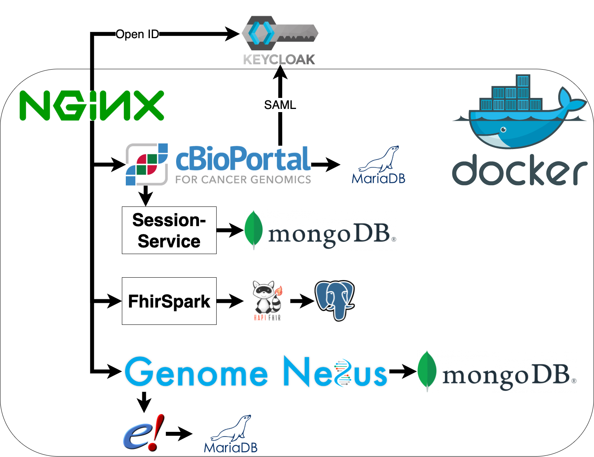

# MIRACUM-cbioportal

## Prerequisites 

- Docker installed
- Docker-Compose installed (Version 1.26.0 or higher)

If you would like to use another container engine, feel free to do so. All images are OCI compliant and have their respective container registry explicitly named in the compose file. 
The whole stack was successfully tested using podman and podman-compose. Just replace the `docker-compose [...]` commands listed below with `podman-compose [...]`

## Installation

We highly recommend to set up your own environment first. This can be done by starting from the example environment: `cp .env.example .env`
Afterwards you can tailor this file to your specific needs. However, the stack will also be able to run without and then fall back to the default settings.
By default cBioPortal will use the port 8080 - if that port is already in use or you prefer a different port please specify this in the `.env` file.

You also may want to use OncoKB, which requires a token that can be obtained [here](https://www.oncokb.org/apiAccess). This must be entered into the `.env` file as well as the asterisk before the parameter `ONCOKB_URL` removed.

Start the initialization process once to setup config file and download seed database:
```
sudo docker-compose -f init.yml run --rm cbioportal
```

There are three different *flavors* of MIRACUM-cbioportal available: 
- *default*: Modified version of cBioPortal with on-premise Genome Nexus instance and additional features such as therapy recommendation, clinical trial search, EMA drug approval, etc.
- *research*: Official cBioPortal image without any modifications but with on-premise Genome Nexus instance
- *dev*: Same as default but exposing the ports specified in the table below

To start the default version simply run
```
sudo docker-compose up -d
```

For *research* or *dev* you need to specify the yml-File?
```
sudo docker-compose -f docker-compose-dev.yml up -d
```

All images with a `ghcr.io/buschlab/` prefix can be rebuilt using the following command:
```
sudo docker-compose -f docker-compose-dev.yml build <service>
```

Such are marked in the table.

## Upgrading from previous releases

When upgrading MIRACUM-cBioPortal we *highly* suggest that you purge the volumes for cBioPortal and Genome Nexus. This will **delete all data that is imported into cBioPortal**. Studies should then be re-imported after the upgrade process.

The upgrade process should then include the following steps:

1. Make a Backup of the HAPI FHIR database using `sudo docker-compose exec hapi-postgres pg_dumpall -U hapiserver > dump.sql`
2. Update the git repository
3. Stop all services using `sudo docker-compose down`
4. Delete cBioPortal and Genome Nexus volumes `sudo docker volume rm -f miracum-cbioportal_cbioportal_data miracum-cbioportal_genomenexus_data`
5. Check `.env.example` file for new parameters you may want to use
6. Set the `RELEASE` in the `.env` file to the release you want to install
  If your selected release is `latest` make sure you use the latest images by executing `sudo docker-compose pull`
7. Start MIRACUM-cBioPortal using `sudo docker-compose up -d`

After the first start of an upgraded MIRACUM-cBioPortal, please check the logs of the Postgres server using `sudo docker-compose logs hapi-postgres`.

You may see something like this:
```
cbioportal_fhirspark_database  | 2021-12-16 09:28:26.055 UTC [1] FATAL:  database files are incompatible with server
cbioportal_fhirspark_database  | 2021-12-16 09:28:26.055 UTC [1] DETAIL:  The data directory was initialized by PostgreSQL version 13, which is not compatible with this version 14.1.
cbioportal_fhirspark_database exited with code 1
```

This is caused by an upgrade to a new major version of Postgres which a requires an additional step, where the volume will be dumped and the dump from step 1 will be imported.
In this case just execute the migration script with `sudo ./upgradePostgres.sh`

### Importing studies

```
sudo docker-compose run --rm cbioportal metaImport.py -u http://cbioportal:8080 -s /study/testpatient -o
```

#### Importing the official study database (optional)

1. Download the database

This is a snapshot of the MySQL-database behind the official cBioPortal instance at cbioportal.org Click [here](http://download.cbioportal.org/mysql-snapshots/public-portal-dump.latest.sql.gz) to download.

2. Deleting the existing database
```
echo "drop database cbioportal; create database cbioportal;" | sudo docker-compose exec -T cbioportal_database mysql -uroot -pP@ssword1
```

3. Importing the study database
```
zcat public-portal-dump.latest.sql.gz | sudo docker-compose exec -T cbioportal_database mysql -uroot -pP@ssword1
```

## Components

- NGINX Reverse Proxy
  - cBioPortal
    - MariaDB Server
  - cBioPortal Session Service
    - Mongo DB
  - FhirSpark
    - HAPI FHIR Server
      - PostgreSQL Server
  - Genome Nexus
    - Mongo DB
    - Ensembl REST API
      - MariaDB Server



## Ports

| Service | Path (behind NGINX) | Port (docker-compose-dev.yml) | Image |
| - | - | - | - |
| NGINX  | / | 8080 | ghcr.io/buschlab/cbioroxy |
| cBioPortal | / | 8081 | ghcr.io/buschlab/cbioportal |
| cBioPortal Debugger | - | 5005 | - |
| cBioPortal DB | - | 3306 | mariadb |
| Session Service | - | 5000 | cbioportal/session-service |
| Session Service DB | - | 27017 | mongo |
| FhirSpark | /mtb/ | 3001 | ghcr.io/buschlab/fhirspark |
| HAPI FHIR Server | /fhir/ | 8082 | hapiproject/hapi |
| PostgreSQL Server | - | 5432 | postgres |
| Genome Nexus | /genome-nexus | 8888 | ghcr.io/buschlab/genome-nexus |
| Genome Nexus DB | - | 27018 | ghcr.io/buschlab/genome-nexus-db |
| Ensembl REST API | - | 8083 | nr205/ensembl-rest |
| Ensembl REST API DB | - | - | ghcr.io/buschlab/ensembl-mysql |


## Debugging

Debugging of the backend can be done by attaching a debugger to it. For VisualStudio Code the MSKCC provides an [example configuration](https://github.com/cBioPortal/cbioportal/blob/master/README.md#%EF%B8%8F%EF%B8%8F-debugging).
