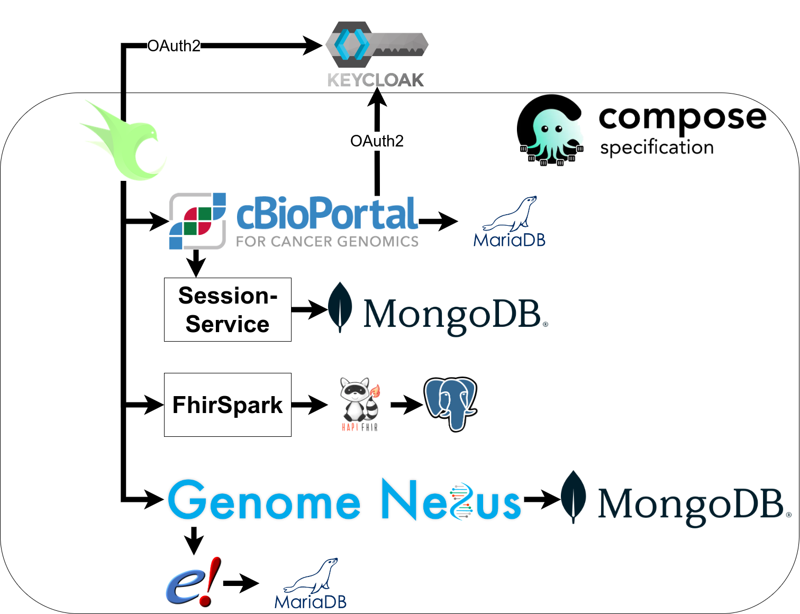

# MTB-cbioportal

This repository is the home of a cBioPortal version that was modified and extended for usage in a molecular tumor board.

## Installation

Installation is described [here](./INSTALL.md)

## Building images yourself

All images with a `ghcr.io/buschlab/` prefix can be rebuilt using the following command:
```
FLAVOR=dev docker compose build <service>
```

Such are marked in the table down below.

## Upgrading from previous releases

When upgrading MTB-cBioPortal we *highly* suggest that you purge all volumes as it is likely that the database server is upgraded to a new major version and the cBioPortal seed database has been updated. 
**This will result in a complete loss of all data that hasn't been backed up before!** As cBioPortal loads it's data from disk, you should still have this saved on disk. You can import the data again in the new version.

The only part that needs a database backup is the HAPI FHIR server. For that please follow these steps:

1. Make a Backup of the HAPI FHIR database using `sudo docker compose exec hapi-postgres pg_dumpall -U hapiserver > dump.sql`
2. Extract the *hapi* database using `sed '/\\connect hapi/,$!d' dump.sql > dump_hapi.sql`
3. Verify that the newly created `dump_hapi.sql` file looks alright.
4. Move the files `dump.sql` and `dump_hapi.sql` as well the directories `reports` and `study`to a different location.
4. Stop all services of MIRMTBACUM-cbioportal using `docker compose down -v` **This will permanently delete all volume data, so you now rely on the backup you created in step 1!**
5. Delete the MTB-cbioportal directory and make a fresh clone of the git repository using `git clone https://github.com/buschlab/MTB-cbioportal.git`
6. Copy dump.sql and dump_hapi.sql to the MTB-cbioportal directory
7. Start the Postgres database using `docker compose up -d hapi-postgres`
8. Import the `dump_hapi.sql` using the following command
`docker compose exec -T hapi-postgres psql -U hapiserver -d hapi < dump_hapi.sql`
9. Proceed with step 2 of the installation as shown in [INSTALL.md](./INSTALL.md)

## Components

- OpenResty Reverse Proxy
  - cBioPortal
    - MariaDB Server
    - cBioPortal Session Service
      - Mongo DB
  - FhirSpark
    - HAPI FHIR Server
      - PostgreSQL Server
  - Genome Nexus
    - Mongo DB
    - Ensembl REST API
      - MariaDB Server



## Ports

| Service | Path (behind OpenResty) | Port (FLAVOR=dev) | Image |
| - | - | - | - |
| OpenResty  | / | 8080 | ghcr.io/buschlab/cbioroxy |
| cBioPortal | / | 8081 | ghcr.io/buschlab/cbioportal |
| cBioPortal Debugger | - | 5005 | - |
| cBioPortal DB | - | 3306 | mariadb |
| Session Service | - | 5000 | cbioportal/session-service |
| Session Service DB | - | 27017 | mongo |
| FhirSpark | /mtb/ | 3001 | ghcr.io/buschlab/fhirspark |
| HAPI FHIR Server | /fhir/ | 8082 | hapiproject/hapi |
| PostgreSQL Server | - | 5432 | postgres |
| Genome Nexus | /genome-nexus | 8888 | ghcr.io/buschlab/genome-nexus |
| Genome Nexus DB | - | 27018 | genomenexus/gn-mongo |
| Ensembl REST API | - | 8083 | nr205/ensembl-rest |
| Ensembl REST API DB | - | - | ghcr.io/buschlab/ensembl-mysql |


## Debugging

Debugging of the backend can be done by attaching a debugger to it. For VisualStudio Code the MSKCC provides an [example configuration](https://github.com/cBioPortal/cbioportal/blob/master/README.md#%EF%B8%8F%EF%B8%8F-debugging).

## License
All code from MTB-cBioPortal is published under the [GNU AGPL v3 License](./LICENSE).
