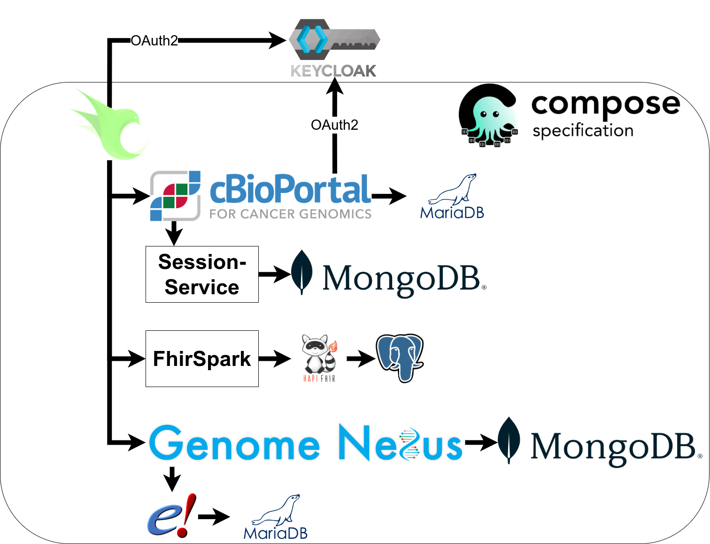

# MTB-cBioPortal

A customized version of [cBioPortal](https://www.cbioportal.org/) adapted for use in a **Molecular Tumor Board (MTB)** context. It extends the standard cBioPortal with additional components for FHIR-based data exchange, genome annotation, and clinical decision support.

---

## Documentation

- [Installation Guide](./INSTALL.md) — how to deploy MTB-cBioPortal
- [Upgrade Guide](./UPGRADE.md) — how to upgrade from a previous release

---

## System Architecture

MTB-cBioPortal is made up of several services that work together:

```
OpenResty (Reverse Proxy)
├── cBioPortal
│   ├── MariaDB (cBioPortal database)
│   └── Session Service
│       └── MongoDB
├── FhirSpark
│   └── HAPI FHIR Server
│       └── PostgreSQL
└── Genome Nexus
    ├── MongoDB
    └── Ensembl REST API
        └── MariaDB
```



---

## Ports & Services

| Service | URL Path | Dev Port | Image |
|---|---|---|---|
| OpenResty (entry point) | `/` | 8080 | `ghcr.io/pm4onco/cbioroxy` |
| cBioPortal | `/` | 8081 | `ghcr.io/pm4onco/cbioportal` |
| cBioPortal DB | — | 3306 | `mariadb` |
| Session Service | — | 5000 | `cbioportal/session-service` |
| Session Service DB | — | 27017 | `mongo` |
| FhirSpark | `/mtb/` | 3001 | `ghcr.io/pm4onco/fhirspark` |
| HAPI FHIR Server | `/fhir/` | 8082 | `hapiproject/hapi` |
| PostgreSQL (HAPI) | — | 5432 | `postgres` |
| Genome Nexus | `/genome-nexus` | 8888 | `ghcr.io/pm4onco/genome-nexus` |
| Genome Nexus DB | — | 27018 | `genomenexus/gn-mongo` |
| Ensembl REST API | — | 8083 | `nr205/ensembl-rest` |
| Ensembl REST API DB | — | — | `ghcr.io/pm4onco/ensembl-mysql` |
| cBioPortal Debugger | — | 5005 | — |

> Services marked with `ghcr.io/pm4onco/` can be rebuilt locally (see [Building Images](#building-images)).

---

## Building Images

Images prefixed with `ghcr.io/pm4onco/` can be rebuilt locally using:

```bash
FLAVOR=dev docker compose build <service>
```

Replace `<service>` with the name of the service you want to build (e.g., `cbioportal`, `genome-nexus`).

---

## Debugging

To attach a debugger to the cBioPortal backend, use port `5005`. For VS Code, MSKCC provides an [example launch configuration](https://github.com/cBioPortal/cbioportal/blob/master/README.md#%EF%B8%8F%EF%B8%8F-debugging).

---

## License

All MTB-cBioPortal code is published under the [GNU AGPL v3 License](./LICENSE).