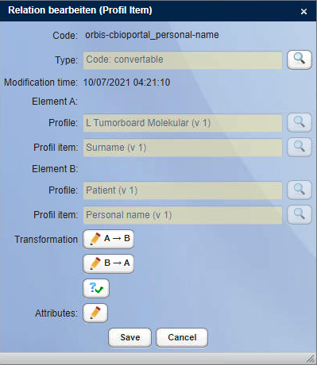
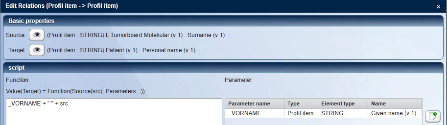
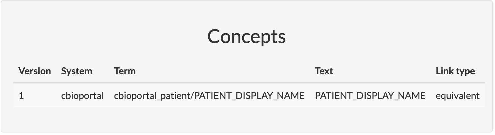
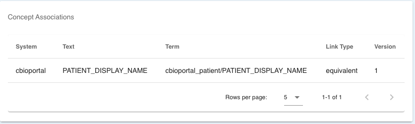

# MtbImporter

MtbImporter is a tool that eases the data integration, management and import of both clinical and mutational data into [cBioPortal](https://cbioportal.org).
It is tested and optimized to work with the core components of the MIRACUM UseCase 3 *Support for Molecular Tumor Boards*, which are available here:

- [MIRACUM-cBioPortal](https://github.com/buschlab/MIRACUM-cBioPortal)
- [MIRACUM-Pipe](https://github.com/AG-Boerries/MIRACUM-Pipe) (v3.0.0 and upwards)

To account for the huge variety of clinical source systems, this tool relies on csv files as input format and uses Metadata Repositories to store data model descriptions and their relations in a source code independent way.

If you want to consume FHIR resources, you will need to flatten them first to a csv based format using tools like [FhirExtinguisher](https://github.com/JohannesOehm/FhirExtinguisher) or [fhircrackr](https://github.com/POLAR-fhiR/fhircrackr).

## Core features

- Automatic detection of input data type
- Supports the following MDRs
    - [Kairos CentraXX MDR](https://www.kairos.de/knowledge-base/produkt/mdr/) (commercial product)
    - [Samply MDR](https://bitbucket.org/medicalinformatics/samply.mdr/src/master/src/site/markdown/index.md) (AGPL-3.0)
    - [DataElementHub](https://github.com/mig-frankfurt/dataelementhub.rest) (AGPL-3.0), see [here](https://github.com/nr23730/dataelementhub-deploy) for Docker deployment
- Annotation of data columns using metadata repository (MDR)
- Code independent data transformation through MDR and Groovy scripts
- Translation of ICD-O-3 classification to OncoTree using FHIR Terminology services
- Further annotation of poorly described variants through VEP
- Record linkage on clinical and mutation data
- Studies are split by presentation date of the patient
- Versioned data management
- Composes a complete cBioPortal study, compatible to the default import format
- Lineage of import process and restart afterwards
- Runs native on JVM 17, Docker and Docker-Compose

## Get started

General assumption: The tools relies on the fact that the mutation data uses the sample id as identifier and that the patient id can be resolved from a FHIR repository.

For a minimal data model description of cBioPortal that covers all attributes provided by the pipeline see [here](https://mdr.itcr.uni-luebeck.de/view.xhtml?namespace=cbioportal).
We also provide a working test dataset for both clinical and mutational data [here](https://github.com/buschlab/MIRACUM-cbioportal/tree/master/tools/MtbImporter/testdata). 

To get started, copy the `settings.yaml.example` file to `settings.yaml`. This avoids future conflicts within the git tree. You need to tailor the configuration parameters to fit your environment first. The following configuration parameters are available:

| Parameter                                    | Description                                                                                                                                                                                                                             |
|----------------------------------------------|-----------------------------------------------------------------------------------------------------------------------------------------------------------------------------------------------------------------------------------------|
| portalUrl                                    | URL where MtbImporter can access cBioPortal                                                                                                                                                                                             |
| portalInfo                                   | Location where to look for the portalinfo on cBioPortal instances that have authentication enabled. If authentication is disabled, simply comment out this line.                                                                        |
| importScriptPath                             | If you don't run MtbImporter inside docker you should set here the absolute path to you metaImport.py script                                                                                                                            |
| inputFolders                                 | List of input folders                                                                                                                                                                                                                   |
| inputFolder.source                           | Input folder that contains new files                                                                                                                                                                                                    |
| inputFolder.target                           | Destination where the processed files will be moved                                                                                                                                                                                     |
| cronIntervall                                | Interval in ms how often the input folders are scanned for new files                                                                                                                                                                    |
| studyFolder                                  | Folder where your cBioPortal studies are located                                                                                                                                                                                        |
| studyTemplate                                | Folder where your main study is and new substudies will be derived from                                                                                                                                                                 |
| mainStudyId                                  | Identifier for your main study                                                                                                                                                                                                          |
| patientIdName                                | Name for the Column that contains the patient id                                                                                                                                                                                        |
| urlBase                                      | Base URL to access the MIRACUM-Pipe reports. Note: This is written to the data_resource_sample.txt and must contain an URL that is accessible by the end users of cBioPortal!                                                           |
| resourceFolder                               | Folder that contains all the PDF reports.                                                                                                                                                                                               |
| overrideWarnings                             | Override warnings when importing study into cBioPortal (-o parameter on metaImport.py)                                                                                                                                                  |
| restartAfterImport                           | Restart cBioPortal after data import                                                                                                                                                                                                    |
| restartCommand                               | If you don't use docker enter here the required command to restart cBioPortal                                                                                                                                                           |
| ensemblUrl                                   | URL that points to the Ensembl REST API for further variant annotation                                                                                                                                                                  |
| fhir                                         | Configuration for FHIR endpoints                                                                                                                                                                                                        |
| fhir.clinicalDataServerUrl                   | Base of a FHIR server that contains resources to resolve patient id from sample id                                                                                                                                                      |
| fhir.terminology                             | Settings for a FHIR terminology server that is used to translate ICD-O-3 classifications to OncoTree codes                                                                                                                              |
| fhir.terminology.serverUrl                   | Base of a FHIR terminology server                                                                                                                                                                                                       |
| fhir.terminology.icdO3Url                    | URI for ICD-O-3 CodeSystem                                                                                                                                                                                                              |
| fhir.terminology.oncoTreeUrl                 | URI for OncoTree CodeSystem                                                                                                                                                                                                             |
| fhir.terminology.icdO3ToOncoTreeConcepMapUrl | FHIR resource URL for the ConceptMap that translates ICD-O-3 to OncoTree                                                                                                                                                                |
| fhir.terminology.icdO3ToOncoTreeConcepMapId  | FHIR resource id for the ConceptMap that translates ICD-O-3 to OncoTree                                                                                                                                                                 |
| regex                                        | Regular expressions to eliminate illegal characters from sample ids. Note: This conversion should be reversible!                                                                                                                        |
| regex.his                                    | Character that needs to be eliminated                                                                                                                                                                                                   |
| regex.cbio                                   | Character that replaces the illegal character                                                                                                                                                                                           |
| mappingMethod                                | Select how you want to map your data. Can be either *groovy* for Samply MDR or DataElementHub or *cxx* for Kairos CentraXX MDR                                                                                                          |
| mdr                                          | Configuration for one ore more metadata repositories                                                                                                                                                                                    |
| mdr.samply                                   | Section for Samply MDR                                                                                                                                                                                                                  |
| mdr.samply.url                               | URL to Samply MDR REST API                                                                                                                                                                                                              |
| mdr.samply.sourceNamespace                   | Namespace for data models of the source system (probaly HIS)                                                                                                                                                                            |
| mdr.samply.targetNamespace                   | Namespace for data models of the target system (cBioPortal)                                                                                                                                                                             |
| mdr.samply.language                          | Language that was assigned to the data elements                                                                                                                                                                                         |
| mdr.samply.mappingEnabled                    | true/false whether this MDR is used only for annotation of cBioPortal clinical data columns or also actual mapping                                                                                                                      |
| mdr.dataelementhub                           | Section for DataElementHub                                                                                                                                                                                                              |
| mdr.dataelementhub.url                       | URL to the DataElementHub REST API                                                                                                                                                                                                      |
| mdr.dataelementhub.tokenUrl                  | URL to the token provider that is configure in DataElementHub (e.g. Keycloak)                                                                                                                                                           |
| mdr.dataelementhub.username                  | Your username for the DataElementHub                                                                                                                                                                                                    |
| mdr.dataelementhub.password                  | The password that that belongs to the account above                                                                                                                                                                                     |
| mdr.dataelementhub.clientId                  | Your OpenID Connect client id                                                                                                                                                                                                           |
| mdr.dataelementhub.clientSecret              | Your OpenID Connect client secret                                                                                                                                                                                                       |
| mdr.dataelementhub.sourceNamespace           | Namespace for data models of the source system (probaly HIS)                                                                                                                                                                            |
| mdr.dataelementhub.targetNamespace           | Namespace for data models of the target system (cBioPortal)                                                                                                                                                                             |
| mdr.dataelementhub.language                  | **_Currently not used!_** Language that was assigned to the data elements                                                                                                                                                               |
| mdr.dataelementhub.mappingEnabled            | true/false whether this MDR is used only for annotation of cBioPortal clinical data columns or also actual mapping                                                                                                                      |
| mdr.cxx                                      | Section for Kairos CentraXX MDR                                                                                                                                                                                                         |
| mdr.cxx.url                                  | URL to CentraXX MDR REST API                                                                                                                                                                                                            |
| mdr.cxx.username                             | Your username for the CentraXX MDR                                                                                                                                                                                                      |
| mdr.cxx.password                             | The password that that belongs to the account above                                                                                                                                                                                     |
| mdr.cxx.basicUsername                        | Your OpenID Connect client id                                                                                                                                                                                                           |
| mdr.cxx.basicPassword                        | Your OpenID Connect client secret                                                                                                                                                                                                       |
| mdr.cxx.mappingEnabled                       | true/false whether this MDR is used only for annotation of cBioPortal clinical data columns or also actual mapping                                                                                                                      |
| docker                                       | Section to configure import/restart of a cBioPortal instance running with Docker                                                                                                                                                        |
| docker.compose                               | Use this if you want to handle the import and restart process through docker-compose. Note: This only works if MtbImporter is running locally on your system. If MtbImporter is running inside a Docker container, this is unavailable. |
| docker.compose.workdir                       | Workdir where your docker-compose.yml for cBioPortal is located                                                                                                                                                                         |
| docker.compose.serviceName                   | Service name that you set for cBioPortal in you docker-compose.yml file                                                                                                                                                                 |
| docker.studyFolder                           | Folder where your study folder is mounted inside the Docker container                                                                                                                                                                   |
| docker.imageName                             | Specify the docker image that you use for cBioPortal (e.g. ghcr.io/buschlab/cbioportal:latest)                                                                                                                                          |
| docker.containerName                         | Specify the full name of you cBioPortal container (required for restart)                                                                                                                                                                |
| docker.networkName                           | Specify the network that the import container needs to attach to                                                                                                                                                                        |
| docker.propertiesFile                        | Absolute path on host filesystem to the portal.properties config file of cBioPortal                                                                                                                                                     |
| docker.portalInfoVolume                      | Specify the full name of your volume that stores the portal info data from cBioPortal                                                                                                                                                   |
| mapping                                      | Mappings from source to target systems. Detailed description [here](#configure-mapping)                                                                                                                                                 |
| mapping.source                               | Identifier of the source data model. Detailed description [here](#configure-mapping)                                                                                                                                                    |
| mapping.target                               | Identifier of the target data model. Detailed description [here](#configure-mapping)                                                                                                                                                    |
| mapping.modelClass                           | Model class of cBioPortal that should be mapped to. Detailed description [here](#configure-mapping)                                                                                                                                     |
## Configure mapping

Mapping is done using a source data model and a target data model and a correspondig (JVM) class of the cBioPortal data model. The corresponcdig section in your `settings.yaml` file may look like this:
```
mapping:
  -
    source: orbis_l-tumorboard-molekular
    target: cbioportal_patient
    modelClass: de.uzl.lied.mtbimporter.model.ClinicalPatient
```

The following model classes are availabe:
- de.uzl.lied.mtbimporter.model.ClinicalPatient
- de.uzl.lied.mtbimporter.model.ClinicalSample
- de.uzl.lied.mtbimporter.model.Cna
- de.uzl.lied.mtbimporter.model.ContinuousCna
- de.uzl.lied.mtbimporter.model.GenePanelMatrix
- de.uzl.lied.mtbimporter.model.Maf
- de.uzl.lied.mtbimporter.model.SampleResource
- de.uzl.lied.mtbimporter.model.Timeline
- de.uzl.lied.mtbimporter.model.TimelineImaging
- de.uzl.lied.mtbimporter.model.TimelineLabtest
- de.uzl.lied.mtbimporter.model.TimelineSpecimen
- de.uzl.lied.mtbimporter.model.TimelineStatus
- de.uzl.lied.mtbimporter.model.TimelineTreatment

There are two special fields for clinical data, that can be used as a mapping target: `ICD_O_3_SITE` and `ICD_O_3_HISTOLOGY` if these attributes are present MtbImporter will try to map the ICD-O-3 classification to OncoTree resulting in the additional columns `ONCOTREE_CODE` and `CANCER_TYPE`.

### Preparation

Each file go through a preparation process. This will generate Map, indexed by the patient id. It can be used to cache information that might be relevant for the whole mapping process. 
In this [example](https://github.com/buschlab/MtbImporter/blob/main/mapper/prepare.groovy) the year and month of first diagnosis is stored. Later it can be used to calculate relative timestamps in timelines or survival times.

### Mapping using Kairos CentraXX MDR

Source and target are forms/profiles/itemsets defined in your CXX MDR. To do an actual data conversion you also have to define *Relations* between the definitions in source and target.

Here *Element A* was selected form the source system, while *Element B* belongs to the target system.



By clicking on the Transformation *A -> B* you'll be able to define a Groovy script that transforms the element from data model *A* to data model *B*.




### Mapping using Samply MDR

Values other than `equal` will be mapped on the fly using Groovy scripts. Those have to be stored in the `mappers` folder within a subfolder for each dataelementgroup. The currently processed variable is accessible as `src`, all other variables are accessible using their identifier in the csv file, but with an underscore as prefix.

Example: You want to map the attribute `NACHNAME` from your source system to the attribute `PATIENT_DISPLAY_NAME` for a patient in cBioPortal. Your Concepts section for the dataelement `NACHNAME` within Samply MDR will look like this:


Your mapping script will be located at the following path and look like this:
`mappers/cbioportal_patient/nachname.groovy`
```
_VORNAME + " " + src
```

### Mapping using DataElementHub

Values other than `equal` will be mapped on the fly using Groovy scripts. Those have to be stored in the `mappers` folder within a subfolder for each dataelementgroup. The currently processed variable is accessible as `src`, all other variables are accessible using their identifier in the csv file, but with an underscore as prefix.

Example: You want to map the attribute `NACHNAME` from your source system to the attribute `PATIENT_DISPLAY_NAME` for a patient in cBioPortal. Your Concepts section for the dataelement `NACHNAME` within DataElementHub will look like this:


Your mapping script will be located at the following path and look like this:
`mappers/cbioportal_patient/nachname.groovy`
```
_VORNAME + " " + src
```

## Authors

- [Niklas Reimer](https://www.systembiologie.uni-luebeck.de/team/alumni/niklas-reimer/) | Group for Medical Systems Biology, Lübeck Institute of Experimental Dermatology, 
Universität zu Lübeck, Germany
  - [@niklas_reimer](https://twitter.com/niklas_reimer)
  - [n.reimer@uni-luebeck.de](mailto:n.reimer@uni-luebeck.de)

## References
- [Requirements Analysis and Specification for a Molecular Tumor Board Platform Based on cBioPortal](https://pubmed.ncbi.nlm.nih.gov/32050609/)
- [Challenges and Experiences Extending the cBioPortal for Cancer Genomics to a Molecular Tumor Board Platform](https://pubmed.ncbi.nlm.nih.gov/34795098/)


## License

GNU Affero General Public License v3 (AGPL-3.0)

## Acknowledgment

This work is funded by the German Federal Ministry of Education and Research (BMBF), grant id 01ZZ1802Z (HiGHmed).
We acknowledge the support through both HiGHmed and MIRACUM consortia as part of the Medical Informatics Initiative Germany.